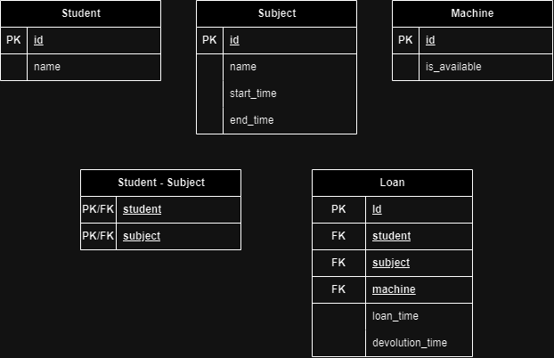

## COMO RODAR O PROJETO:
- abri um emulador android ou conectar o celular com USB
- use o comando: npx expo start
- no menu: "a" para abrir para android

## Documentação

Tecnologias usadas:  
- React-Native com expo  
- SQLite

### Banco de dados
#### DER

#### Tabelas - modelo relacional

